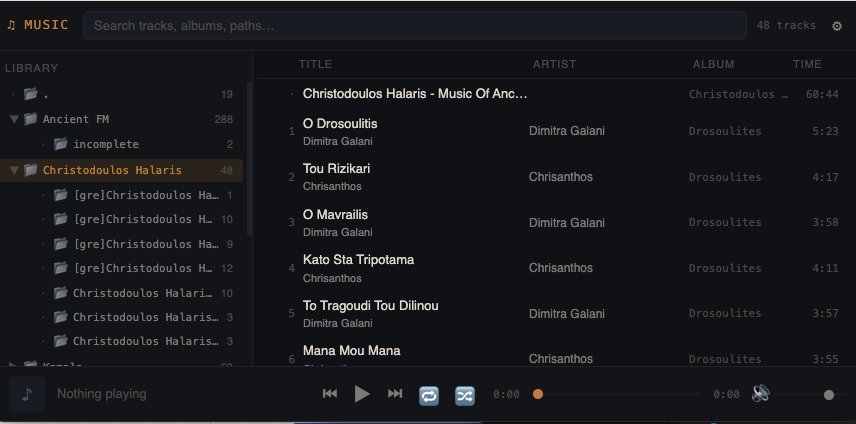

# HTML music library generator script

Python script to create an HTML audio library file listing in a flat page all the media files under a given folder (current folder by default).

## Usage

Generate an HTML library with all audio files under the current folder. The default file name is `mu.html` in the target folder:

```bash
music-gallery-creator.py
```

Generate a library file for a custom folder including video files, skipping folder names containing `testing` and `unsorted` (the index will be created under `~/Music/music.html`):

```bash
music-gallery-creator.py ~/Music --videos --output-file music.html --ignored testing unsorted
```

## Screenshots



## Command line flags

For commmand line usage run `music-gallery-creator.py -h`:

```bash            
usage: mugal26.py [-h] [--output-file output_file] [--videos] [--ignored [ignore ...]]
                [--follow_symlinks] [--verbose]
                [gallery_root]

Music gallery Generator

positional arguments:
  gallery_root          Gallery root, by default current folder (.)

options:
  -h, --help            show this help message and exit
  --output-file, -o output_file
                        Output filename (mu.html)
  --videos, -m          Include videos
  --ignored, -i [ignore ...]
                        Custom ignored path segments. Accepts multiple segments, e.g. -i junk1
                        junk2 junk3 ([])
  --follow_symlinks, -f
                        Follow symlinks (False)
  --verbose, -v         Verbose output (False)
```
